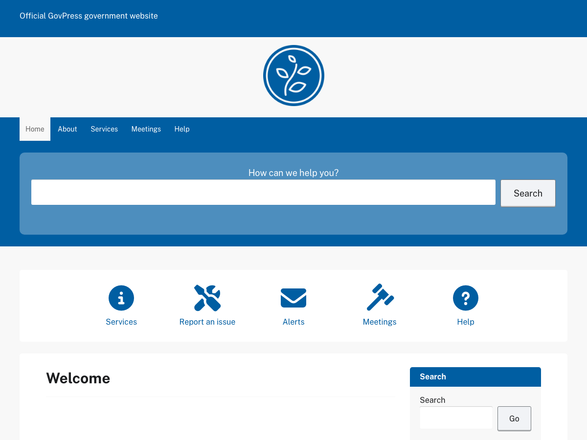

# GovPress

[GovPress](https://github.com/govfresh/govpress) is a free WordPress theme for government and public-sector websites, designed around WCAG accessibility guidelines with automatic light and dark mode that follows each visitor's device settings — no toggle required.



### Demo

[GovPress on WordPress.org](https://wordpress.org/themes/govpress/)

### Requirements

* WordPress 5.0+
* PHP 7.4+

### Installation

* From WordPress.org — Appearance > Themes > Add New, search for "GovPress" and install.
* From GitHub — download or clone this repository into `wp-content/themes/govpress`, then activate it under Appearance > Themes.

### Features

* Designed around WCAG accessibility guidelines
* Automatic light and dark mode, based on the visitor's device settings
* Configurable banner position, menu placement and colors via the Customizer
* Optional icon navigation menu for the homepage
* Self-hosted fonts (Public Sans, Font Awesome) — no external font requests
* Mobile-friendly and adapts to all devices (PC, laptop, tablet, smartphone)
* No vendor lock-in so you can easily move your data at any time

### Configuration

All of the following are set under Appearance > Customize.

#### Site Identity
* Upload a logo, plus an optional Dark Mode Logo shown instead when a visitor's device is set to dark mode
* Site title, tagline and site icon

#### Colors
* Primary Color, Primary Link Color, Primary Link Hover and Header Tagline Color
* Applied in light mode only — dark mode always uses the theme's own accessible dark palette, so a chosen color scheme never fights the built-in dark mode

#### Banner & Menu Position
* Site Banner Position (top or bottom of page) and Alignment (center or left) — displays "Powered by GovPress" or the "Banner Text" widget area, for example an official government website notice
* Primary Menu Position (above or below the logo/title)

#### Layout
* Choose one column, or two columns with the sidebar on the left or right

#### Icon Menu
* Assign a menu to the "Icon Menu" location (Appearance > Menus) to display an icon navigation grid on the Home Page template. Each menu item's icon comes from its CSS classes ([Font Awesome](https://fontawesome.com) icon classes are supported)

### Templates

#### Home Page
Adds the Home Page Hero and Home Page Featured widget areas, plus the Icon Menu, above the main content.

#### Full Page
Displays a page without a sidebar.

### Widget Areas

* Sidebar
* Home Page Hero
* Home Page Featured
* Banner Text
* Footer Area One, Two, Three

### Development

Requires [Node.js](https://nodejs.org/) and [Grunt](https://gruntjs.com/).

```
npm install
npx grunt         # compile scss/style.scss to style.css
npx grunt watch   # recompile on file changes
npx grunt release # compile, concat/minify JS, generate .pot and style-rtl.css
```

### Credits

* Public Sans by USWDS - https://public-sans.digital.gov. License: SIL OFL 1.1.
* Font Awesome Free by Fonticons - https://fontawesome.com. License: SIL OFL 1.1 (fonts), CC BY 4.0 (icons), MIT (code).

### License

GPLv2 or later. See [LICENSE.txt](LICENSE.txt).

### Contribute

We'd love to have as many eyes on this project as possible. If you find a bug or something that can be improved please open an issue and/or submit a pull request.
